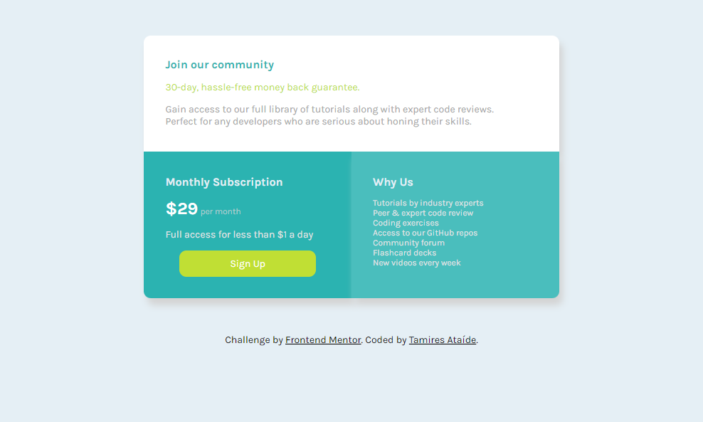

# Frontend Mentor - Single price grid component solution

This is a solution to the [Single price grid component challenge on Frontend Mentor](https://www.frontendmentor.io/challenges/single-price-grid-component-5ce41129d0ff452fec5abbbc). Frontend Mentor challenges help you improve your coding skills by building realistic projects. 

## Table of contents

- [Overview](#overview)
  - [The challenge](#the-challenge)
  - [Screenshot](#screenshot)
  - [Links](#links)
  - [Built with](#built-with)
  - [What I learned](#what-i-learned)
  - [Continued development](#continued-development)
  - [Useful resources](#useful-resources)
- [Author](#author)

## Overview

### The challenge

Users should be able to:

- View the optimal layout for the component depending on their device's screen size
- See a hover state on desktop for the Sign Up call-to-action

### Screenshot

### Links

- Solution URL: [Add solution URL here](https://your-solution-url.com)
- Live Site URL: [Add live site URL here](https://your-live-site-url.com)

### Built with

- Semantic HTML5 markup
- CSS custom properties
- Flexbox
- Mobile-first workflow

### What I learned

With this challenge I learned how to implement flexboxes, learned more about css grids and the advantages of mobile first workflow. It was an amazing way to apply in a more practical approach everything I've been learning so far.

### Continued development

This project helped implementing the things I had already learned from HTML and CSS but it also made me seek knew knowledge and discover different ways of doing what I already knew. It was an experience that made me interested in discovering different features and workflows to better my code. As a beginner I want to also learn more javascrip in order to feel confident enough to implement it in projects like this one.

### Useful resources

- [Flexbox guide - CSS Tricks](https://css-tricks.com/snippets/css/a-guide-to-flexbox/#aa-background) - This helped me to implement the flex boxes, being able to display the content of the two bottom columns the way the challenge asked.
- [Mobile First workflow - CSS tricks](https://css-tricks.com/forums/topic/any-advice-on-mobile-first-workflow/) - This explains on a simple way how mobile first workflow is implemented, how you can do it and all the advantages of following this specific workflow.

## Author

- [Github](https://github.com/tamiresataide)
- [Linkedin](https://www.linkedin.com/in/tamiresataide/)
- Frontend Mentor - [@tamiresataide](https://www.frontendmentor.io/profile/tamiresataide)

